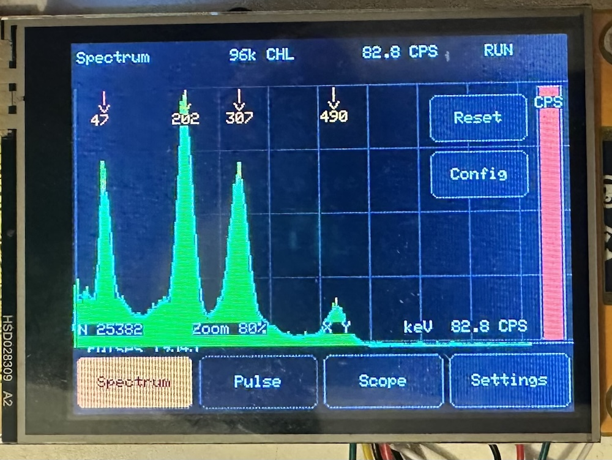
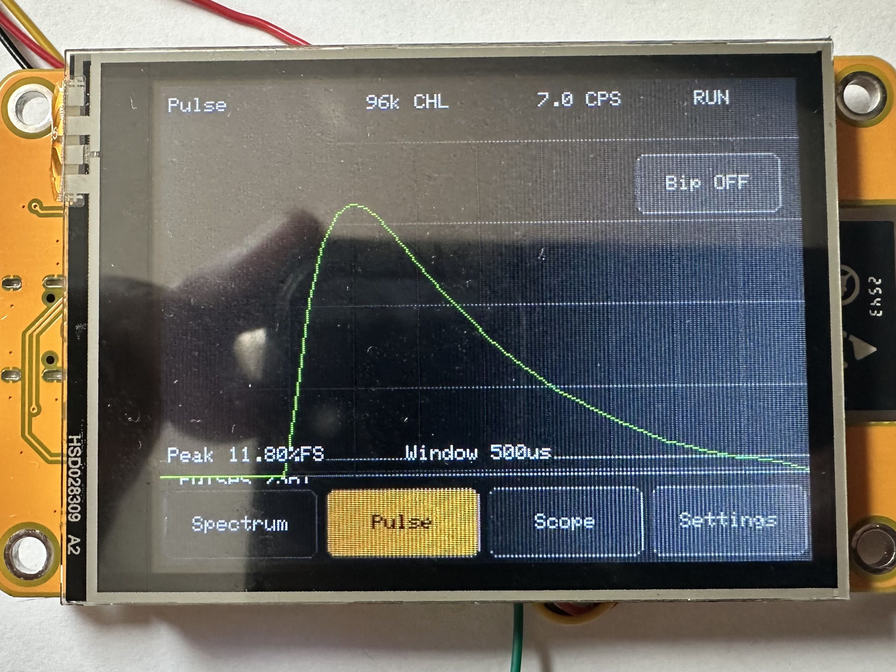
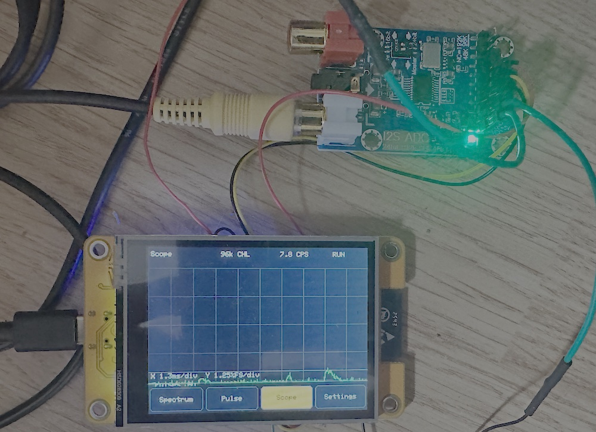

# ESP32 CYD Gamma Spectrometer


An ESP32 gamma pulse spectrometer for the **ESP32-2432S028R Cheap Yellow Display** and an external **I2S ADC audio capture board**. May work with other ESP32 board with minor modifications.

The sketch reads a fast 32-bit stereo I2S stream from the ADC module, detects pulses from a photomultiplier front-end, estimates pulse height, and builds a live pulse-height spectrum on the CYD touchscreen.






## Detector front-end

This build uses the [Theremino PMT Adapter](https://www.theremino.com/wp-content/uploads/2013/03/PmtAdapters_ENG.pdf) as the analog front-end between the scintillation detector and the digitizer. The adapter is designed for photomultiplier-based gamma spectrometry: it generates the PMT high-voltage supply, conditions the fast PMT current pulses, and stretches/shapes them into a signal suitable for digitization by audio-style ADC hardware. In this project, that conditioned output is connected to a **WM8782 I2S ADC** board, which streams samples to the ESP32 over I2S.

The scintillation head used for this build is an **XP2011B photomultiplier** coupled to a **NaI(Tl) scintillation crystal**. For the mechanical PMT/scintillator assembly approach, see my video: [PMT assembly video](https://www.youtube.com/watch?v=2bbyb1C-hIE).

## Hardware

- ESP32-2432S028R / Cheap Yellow Display (CYD) with ILI9341 display and XPT2046 touch controller
- Theremino PMT Adapter
- A photomultiplier scintillation crystal (Screenshots have been made with XP2011B with NaI(Tl) crystal)
- WM8782 I2S ADC audio capture board or other I2S ADC (see https://www.pschatzmann.ch/home/2021/11/17/using-a-i2s-adc-audio-i2s-capture-card-module-with-an-esp32/ )
- Optional small speaker on the CYD speaker connector

The ADC module is expected to be the **I2S master** and the ESP32 is configured as an **I2S slave**. Set the ADC module jumper so its `CLOCK OUT` feeds its own `MCLK IN`.

Theremino PMT is powered by USB (same USB Powerbank for ESP32 / I2S CAN and Theremino) and output signal is connected to I2S ADC througt a (maybe unecessary) 1uF capacitor.

## I2S wiring

| WM8782 ADC board | CYD GPIO |
| --- | --- |
| BICK / BCLK | GPIO23 |
| RLCLK / WS | GPIO19 |
| DATA | GPIO18 |
| GND | GND |
| VCC | 5V |

The CYD speaker output uses GPIO26.

You can use SD Card GPIO (with an "sd card sniffer") if your CYD do not expose theses GPIO.

## Main screens

### Spectrum

The default screen shows the pulse-height histogram:

- 192 energy bins for a finer trace
- Runtime `Log ON/OFF` button for logarithmic or linear Y scaling
- `Reset` button to clear the spectrum and counters
- CPS gauge on the right with green to red scale depending on CPS
- RGB LED follows the CPS rate and flashes blue briefly on each accepted pulse

The horizontal scale is controlled by `Spectrum zoom` in the settings page. Changing the zoom clears the histogram because already-binned pulses cannot be redistributed correctly without storing the full pulse history.

### Pulse

The pulse page displays the latest captured pulse waveform and the measured peak height.

It also contains a runtime `Bip ON/OFF` button. The default is `Bip OFF`. When enabled, each pulse emits a very short PWM beep on GPIO26.

### Scope

The scope page displays a simple min/max oscilloscope view of the baseline-centered signal. It is useful for checking noise, pulse polarity, threshold, and rough pulse width.

The footer shows:

- horizontal scale in time per division
- vertical scale in `%FS` per division

## Settings

The main settings page provides:

- `Spectrum zoom`: histogram full-scale as a percentage of ADC full-scale
- `Noise threshold`: trigger threshold as a percentage of ADC full-scale
- `Sample rate`: 48, 96, or 192 kHz (depending on your ADC card settings)
- `Pulse window`: pulse capture length
- `Filters`: opens the filter settings page

The filter page provides buttons for:

- `HF`: enables or disables the light IIR low-pass filter
- `Hyst`: enables or disables trigger hysteresis
- `Trap`: enables or disables the trapezoidal shaping filter
- `Back`: returns to the main settings page

It also lets you tune the trapezoidal filter:

- `Rise`: integration length in samples
- `Gap`: flat-top gap in samples

Changing filter parameters resets the measurements so the spectrum does not mix incompatible shaping settings.

## Filters

### HF low-pass filter

The HF filter is a light single-pole IIR filter applied before pulse detection:

```cpp
lowPassState += (rawSignal - lowPassState) / (1 << LOWPASS_SHIFT);
```

With `LOWPASS_SHIFT = 2`, the smoothing factor is 1/4. Increase the value for stronger smoothing, or decrease it if pulses become too rounded or lose too much amplitude.

### Hysteresis

With hysteresis enabled, the detector triggers at the normal threshold but only re-arms after the filtered signal falls below:

```cpp
threshold / HYSTERESIS_LOW_DIV
```

This avoids repeated triggers caused by high-frequency noise around the threshold. Lower divisors re-arm earlier; higher divisors wait for a deeper return toward baseline.

### Trapezoidal filter

The trapezoidal filter is an optional digital shaper. It compares two moving integration windows separated by a gap:

```cpp
trapAccumulator += x[n]
                 - x[n - L]
                 - x[n - L - G]
                 + x[n - 2L - G];

trapOutput = trapAccumulator / L;
```

Where:

- `L` is `Rise`
- `G` is `Gap`
- `x[n]` is the current baseline-corrected sample after optional HF filtering

The result is a shaped signal with reduced high-frequency noise and a flatter region that can be easier to threshold and measure than the raw pulse peak. Because the trapezoidal filter changes the signal gain and timing, you will usually need to re-adjust the noise threshold when enabling it.

For faster count rates, keep `Rise` and `Gap` small. Larger values improve smoothing but increase shaping time and can merge closely spaced pulses.

## Fast count-rate behavior

The main loop processes complete I2S blocks before returning to the display, and the spectrum is redrawn periodically.

Current fast-count defaults:

- `I2S_FRAMES = 512`
- I2S DMA buffers: 12 descriptors of 128 frames
- `pulseSamples = 48`
- `REARM_SAMPLES = 4`
- `HYSTERESIS_LOW_DIV = 2`


## Arduino IDE

Open `CYD_GammaSpectrometer.ino` and install:

- LovyanGFX
- ESP32 Arduino core with the new I2S standard driver

Use an ESP32 development board profile such as `ESP32 Dev Module`.

## Notes

- The sketch uses `driver/i2s_std.h`.
- The CYD RGB LED is active-low by default. Change `RGB_LED_ACTIVE_LOW` if your board revision behaves differently.

## Licence
CC BY-NC 4.0 See licence.txt file# ESP32-Gamma-Spectrometer
